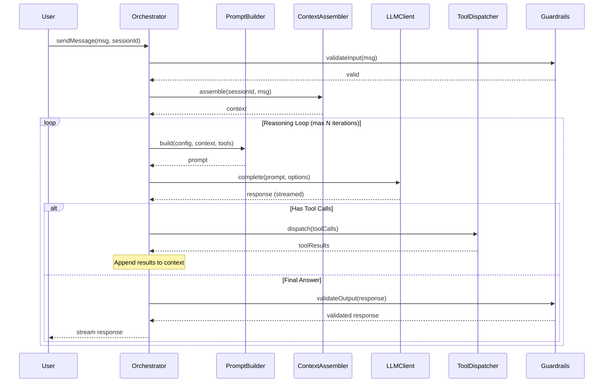

# C4 Level 4: Code Diagram

Detailed view of the Orchestrator component's internal structure and key interfaces.

```mermaid
classDiagram
    class Orchestrator {
        -agentConfig: AgentConfig
        -sessionStore: SessionStore
        -maxIterations: int
        +run(userMessage: Message, sessionId: string): AsyncStream~Response~
        -executeLoop(context: Context): AsyncStream~Response~
        -handleToolCalls(toolCalls: ToolCall[]): ToolResult[]
    }

    class AgentConfig {
        +id: string
        +name: string
        +systemPrompt: string
        +tools: ToolDefinition[]
        +memoryConfig: MemoryConfig
        +guardrailRules: GuardrailRule[]
        +maxTurns: int
        +temperature: float
    }

    class PromptBuilder {
        +build(config: AgentConfig, context: Context, tools: ToolDefinition[]): Prompt
        -allocateTokenBudget(prompt: Prompt, maxTokens: int): Prompt
        -renderToolDescriptions(tools: ToolDefinition[]): string
    }

    class LLMClient {
        <<interface>>
        +complete(prompt: Prompt, options: LLMOptions): AsyncStream~LLMResponse~
        +countTokens(text: string): int
    }

    class ClaudeLLMClient {
        -apiKey: string
        -baseUrl: string
        +complete(prompt: Prompt, options: LLMOptions): AsyncStream~LLMResponse~
        +countTokens(text: string): int
    }

    class ToolDispatcher {
        -toolRegistry: Map~string, ToolExecutor~
        +dispatch(toolCall: ToolCall): Promise~ToolResult~
        +validate(toolCall: ToolCall): ValidationResult
    }

    class ContextAssembler {
        -memoryManager: MemoryManager
        -tokenBudget: int
        +assemble(sessionId: string, newMessage: Message): Context
        -summarizeIfNeeded(history: Message[]): Message[]
        -retrieveRelevantMemory(query: string): Memory[]
    }

    class Guardrails {
        -rules: GuardrailRule[]
        +validateInput(message: Message): ValidationResult
        +validateOutput(response: Response): ValidationResult
    }

    class Context {
        +systemPrompt: string
        +conversationHistory: Message[]
        +relevantMemory: Memory[]
        +availableTools: ToolDefinition[]
        +tokenCount: int
    }

    class ToolCall {
        +id: string
        +name: string
        +parameters: object
    }

    class ToolResult {
        +toolCallId: string
        +output: object
        +error: string?
        +durationMs: int
    }

    Orchestrator --> PromptBuilder : uses
    Orchestrator --> LLMClient : uses
    Orchestrator --> ToolDispatcher : uses
    Orchestrator --> ContextAssembler : uses
    Orchestrator --> Guardrails : uses
    Orchestrator --> AgentConfig : configured by
    LLMClient <|.. ClaudeLLMClient : implements
    ToolDispatcher --> ToolCall : processes
    ToolDispatcher --> ToolResult : returns
    ContextAssembler --> Context : produces
```

## Key Interfaces

### Message Flow

## Design Notes

- `LLMClient` is an interface to allow swapping providers without changing orchestration logic
- `ContextAssembler` owns the token budget and decides what fits in the context window
- `Guardrails` runs on both input and output to catch issues early
- The reasoning loop has a configurable max iteration count to prevent runaway agents
