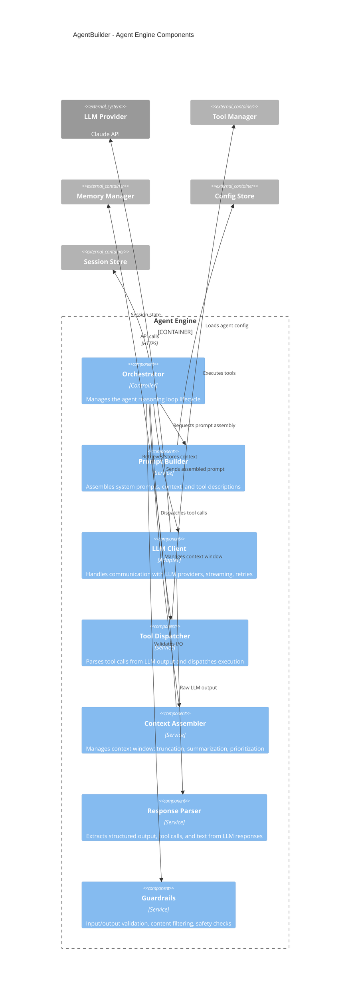

# C4 Level 3: Component Diagram

Zooms into the Agent Engine — the core container — showing its internal components.

## Component Details

### Orchestrator
The central control loop. For each user message:
1. Load session state and agent config
2. Assemble context (memory + conversation history)
3. Build prompt (system prompt + context + tools)
4. Call LLM
5. Parse response for tool calls or final answer
6. If tool calls: execute, append results, goto step 3
7. If final answer: apply guardrails, return to user

### Prompt Builder
- Assembles the full prompt from templates, agent persona, tool descriptions
- Handles token budget allocation across system prompt, context, and conversation

### LLM Client
- Abstracts LLM provider differences behind a common interface
- Handles streaming, retries, backoff, and error classification

### Tool Dispatcher
- Validates tool call parameters against registered schemas
- Executes tools with timeout and error handling
- Returns structured results back to the orchestrator

### Context Assembler
- Implements sliding window over conversation history
- Triggers summarization when context exceeds budget
- Prioritizes recent messages and relevant memory

### Guardrails
- Input validation (prompt injection detection)
- Output filtering (PII, harmful content)
- Rate limiting per user/agent
