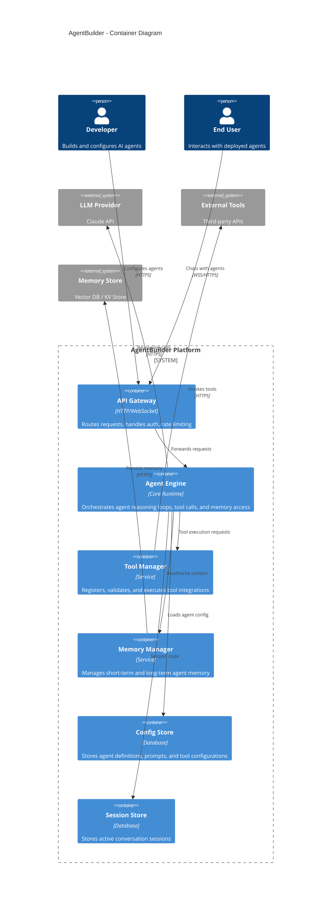

# C4 Level 2: Container Diagram

Shows the high-level technical building blocks of AgentBuilder.

## Container Responsibilities

| Container | Responsibility | Technology Candidates |
|-----------|---------------|----------------------|
| API Gateway | Auth, routing, rate limiting | Express/Fastify, API Gateway |
| Agent Engine | Core orchestration loop | Custom runtime, event-driven |
| Tool Manager | Tool registration & execution | Plugin architecture |
| Memory Manager | Context window management | Sliding window + summarization |
| Config Store | Agent definitions & prompts | PostgreSQL / SQLite |
| Session Store | Active conversation state | Redis / in-memory |

## Data Flow

1. User sends message via API Gateway
2. Gateway authenticates and routes to Agent Engine
3. Agent Engine loads agent config and session state
4. Engine enters reasoning loop: LLM call -> tool use -> memory update -> repeat
5. Response streamed back through Gateway to user
