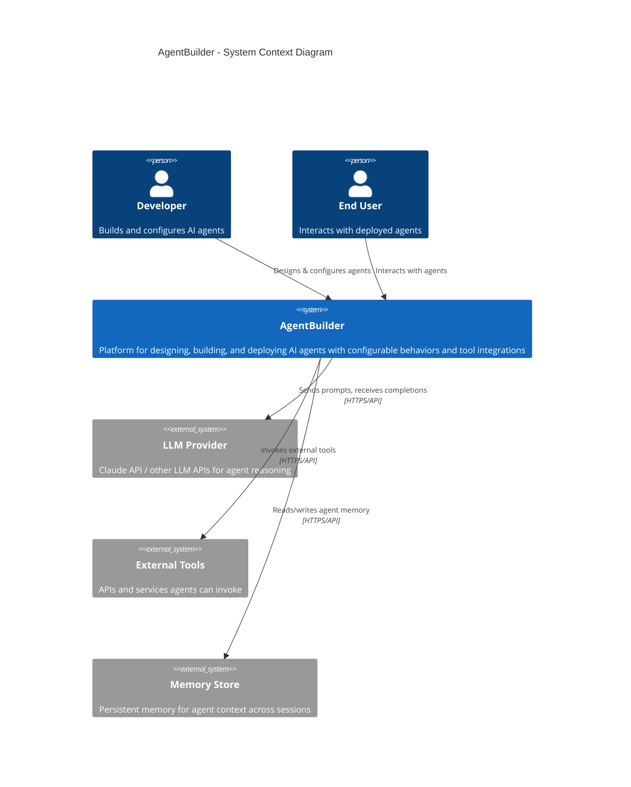

# C4 Level 1: System Context Diagram

The highest-level view showing AgentBuilder and its relationships with users and external systems.

## Key Interactions

| From | To | Description | Protocol | Latency Requirement |
|------|----|-------------|----------|-------------------|
| Developer | AgentBuilder | Agent configuration & design | HTTP/WebSocket | < 200ms UI response |
| End User | AgentBuilder | Conversational interaction | HTTP/WebSocket | < 500ms first token |
| AgentBuilder | LLM Provider | Reasoning & generation | HTTPS | < 2s first token |
| AgentBuilder | External Tools | Tool execution | HTTPS | < 5s per tool call |
| AgentBuilder | Memory Store | Context persistence | HTTPS | < 100ms read/write |

## Notes

- The system acts as an orchestration layer between users and LLM providers
- External tools are dynamically registered and invoked based on agent configuration
- Memory store enables agents to maintain context across sessions
